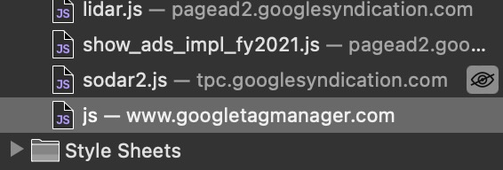
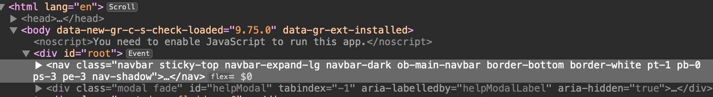
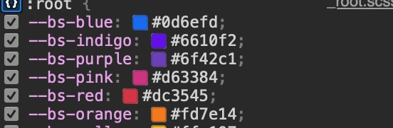

# Web Inspection of Old Bailey Online

## Link to the Website
[Old Bailey Online](https://www.oldbaileyonline.org)

## Link to the GitHub Repository
[## Link to the GitHub Repository
[OBO-APIextraction-and-Analysis](https://github.com/spmp/OBO-APIextraction-and-Analysis)

## Web Technologies Used
- **HTML**: Used for structuring the webpage, as seen in the `<nav>`, `
`, and other HTML tags.
- **CSS**: Styling is applied via classes like `navbar`, `bg-white`, and `col-lg-6`.
- **JavaScript**: Referenced in .js files for interactive elements.

### Files Identified
- **HTML Files**: Present for page structure.
- **CSS Files**: Used for styling, with references to specific stylesheets.
- **JavaScript Files**: .js files are used for additional functionality.
- **Other Files**: Includes images (.jpg, .png), SVGs, and JSON files.

## Who Built the Website?
The website is a collaborative project involving multiple institutions and individuals, as acknowledged on their site. Contributors include funding bodies like the Arts and Humanities Research Council, technical support from the Digital Humanities Institute at the University of Sheffield, and others listed in the acknowledgments.

## Images

### JavaScript Files
  
*Image 1: Shows JavaScript files like lidar.js, show_ads_impl_fy2021.js, and others from Google services. These are used for functionalities such as tracking and ads.*

### CSS Variables
  
*Image 2: Displays CSS variables for colors (e.g., --bs-blue, --bs-indigo). These are part of a stylesheet, likely from a framework like Bootstrap, used for consistent styling.*

### HTML Structure
  
*Image 3: Shows the HTML structure with elements like `<nav>` for navigation, styled using CSS classes like `navbar` and `sticky-top`.*

### CSS File
  
*Image 4: Displays the CSS file associated with the website, highlighting key styling rules and structures.*

## Conclusion
This inspection of the Old Bailey Online website highlights the integration of HTML, CSS, and JavaScript technologies, showcasing a well-structured, interactive, and visually appealing digital resource.
